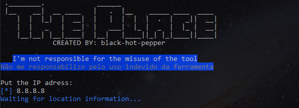
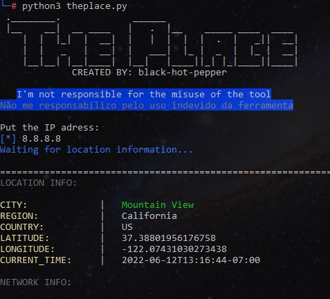
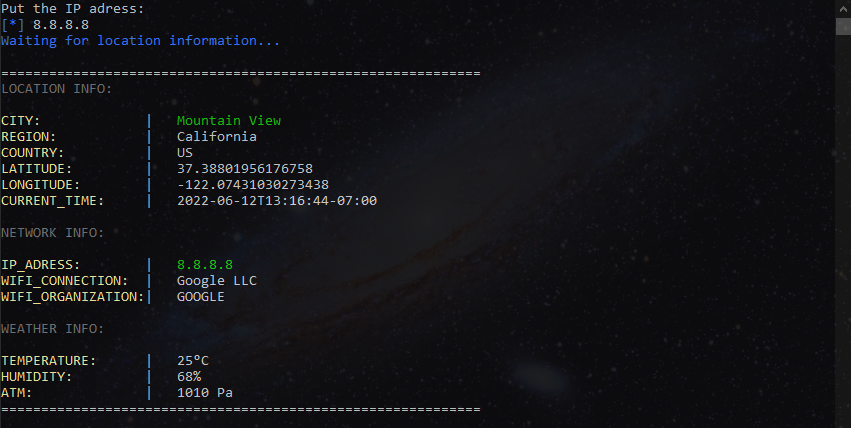

# ThePlace🗺️
🔍A simple program made with python for IP geolocation🔍

<div>
  ThePlace is a geolocator based on the IP address, using an <b>API</b> to locate it. <br>This program was developed non-profit, with the objective of assisting in <b>penetration testing</b>.
</div>
<div>
  <br>
  
  
  
</div>
<div>
  <h2>HOW TO INSTALL</h2>
  <p>In Linux OS, you must do the command block below:</p>
  
  ```
  git clone https://github.com/BlackHotPepper/ThePlace/
  cd ThePlace
  chmod +x theplace.py
  python3 theplace.py
  ```
  <p>In Windows OS, you can run it in your Python terminal or install WSL in your system! Open your computer and execute the command line below. After that and made the initial settings, you can execute the linux command block!</p>
  
  ```
  wsl --install
  ```
  
  <p>Another way to install the program, is by <b>GIT</b> for Windows! Check it: https://gitforwindows.org/</p>
  
  <div style="display: inline-flex;">
    
    
    
  </div>
</div>
<br>
<hr>
<p>🔴I'm not responsible for the misuse of the tool!🔴</p>
<hr>

